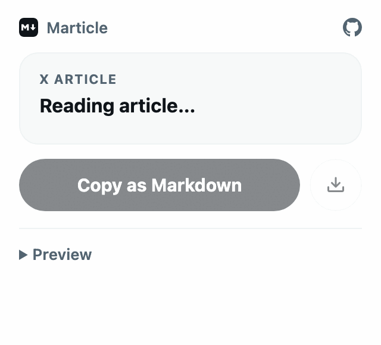

<p align="center">
  
</p>

<h1 align="center">Marticle</h1>

<p align="center"><strong>Copy that.</strong> One click turns any X Article into clean Markdown.</p>

<p align="center">
  <a href="https://github.com/albert-mr/marticle/actions/workflows/test.yml"></a>
  
  
  <a href="LICENSE"></a>
</p>

<p align="center">
  
</p>

## Why

X Articles are long, often good, and stuck inside X. Screenshots throw away the text. Select-all drags the sidebar along.
A link is useless to a model that can't open it. Marticle grabs the actual article, keeps the formatting, and puts Markdown
on your clipboard. Paste it into Claude, ChatGPT, Obsidian, or a plain text file.

## Install

Marticle is distributed here rather than on the Chrome Web Store. Load it as an unpacked extension:

1. Download the zip from the [latest release](https://github.com/albert-mr/marticle/releases/latest) and unzip it. (Or `git clone` this repo and use its `extension` folder.)
2. Open `chrome://extensions`, turn on **Developer mode**, click **Load unpacked**, and pick the unzipped folder.
3. Pin Marticle from the puzzle-piece menu so it's one click away.

Works in any Chromium browser: Chrome, Brave, Edge, Arc.

## Use

Open an article on x.com and click Marticle.

- **Copy as Markdown** puts the article on your clipboard.
- **⤓** saves it as a `.md` file named after the title.
- **Preview** shows exactly what you'll get.

## What you get

- Title, author, publish date, and source URL at the top
- Headings, bold, italic, strikethrough, links, quotes, lists, code blocks, tables, and math
- Images as direct full-resolution URLs with alt text and captions
- Embedded posts as quoted blocks with attribution and links
- Videos as links. Nothing is transcribed or invented.

Marticle copies what the page has loaded. If X hasn't finished rendering the article, wait a moment and click **Try again**.
Image links don't attach the actual images to an AI chat; upload those separately when the model needs to see them.

## Privacy

Marticle reads the current tab only when you click it, converts the article in memory, and hands you the result.
It makes no network requests and stores nothing.

Permissions: `activeTab` and `scripting` to read the open article, `clipboardWrite` to copy it.

## Development

```sh
npm ci
npm test
```

The extractor is `extension/extract.js`, one self-contained function that Chrome injects into the article tab.
The popup is `extension/popup.js`. Tests run both against fixture DOMs in jsdom. Pull requests welcome.

## Credits

The extraction and Markdown conversion were adapted from [X Article Export](https://github.com/everettjf/x-article-export-pdf) by everettjf (MIT).
X's DOM structure was cross-checked against [Defuddle](https://github.com/kepano/defuddle)'s test fixtures.
The icon uses the public-domain [Markdown Mark](https://github.com/dcurtis/markdown-mark).

[MIT](LICENSE) © Albert Martinez. Not affiliated with X Corp.
